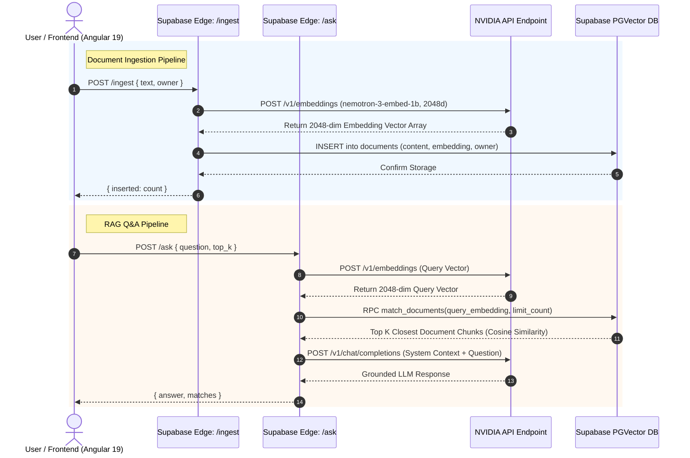

# Enterprise RAG Demo: Angular 19 + Supabase pgvector + NVIDIA NIM

[](https://angular.dev/)
[](https://supabase.com/)
[](https://build.nvidia.com/)
[](LICENSE)

A production-ready **Retrieval-Augmented Generation (RAG)** application leveraging **Angular 19** for the frontend UI, **Supabase PostgreSQL** with **`pgvector`** for high-dimensional vector similarity search, and **NVIDIA NIM (Microservices)** for document embeddings (`nemotron-3-embed-1b`, 2048-dim) and grounded answer generation (`poolside/laguna-xs-2.1`).

---

## 📐 Architecture & System Flow



---

## 🛠️ Technology Stack

| Layer | Component / Technology | Specification |
|---|---|---|
| **Frontend UI** | Angular 19 | Standalone Components, RxJS, SCSS |
| **Edge Compute** | Supabase Edge Functions | Deno Runtime, TypeScript, Deno HTTP |
| **Vector Database** | Supabase (PostgreSQL) | `pgvector` extension, 2048-dimension HNSW/IVFFlat |
| **Embeddings AI** | NVIDIA Microservices | `nvidia/nemotron-3-embed-1b` (2048 dimensions) |
| **LLM Inference** | NVIDIA Microservices | `poolside/laguna-xs-2.1` Chat Completions |

---

## 📁 Repository Structure

```text
rag-supabase-nvidia-demo/
├── .env.example                 # Template for local & remote secrets
├── AGENT.md                     # AI Coding Agent System Prompt & Reference Guide
├── README.md                    # System Architecture & Operational Guide
├── angular.json                 # Angular 19 build configuration
├── package.json                 # Node.js dependencies & scripts
├── src/
│   ├── app/
│   │   ├── app.component.ts     # Main SPA Layout Component
│   │   ├── components/          # Ingest, Ask, & Document View components
│   │   └── services/            # Angular Services (Supabase & Edge API client)
│   └── environments/            # Angular Client Config
└── supabase/
    ├── config.toml              # Supabase Local Stack Config
    ├── migrations/              # SQL Database Schema & RAG Functions
    │   ├── 000_init_pgvector_documents.sql
    │   └── 20260726000000_nvidia_embeddings_2048.sql
    └── functions/               # Serverless Deno Edge Functions
        ├── ingest/              # Document chunking & embedding storage
        └── ask/                 # Vector search & grounded LLM generation
```

---

## ⚡ Prerequisites

Make sure the following tools are installed in your environment:

- **Node.js**: `^20.x` or `^22.x`
- **npm**: `^10.x`
- **Angular CLI**: `^19.x` (`npm install -g @angular/cli`)
- **Supabase CLI**: `^1.x` (`npm install -g supabase` or `npx supabase`)
- **Docker Desktop**: Required *only* for local Supabase database & edge runtime execution.
- **NVIDIA API Key**: Obtainable from [NVIDIA Build API Portal](https://build.nvidia.com/).

---

## 🔑 Environment Variables Configuration

Create a `.env` file in the project root:

```bash
cp .env.example .env
```

Populate the required environment variables:

```env
# Supabase Configuration
SUPABASE_URL=https://<your-project-ref>.supabase.co
SUPABASE_SERVICE_ROLE_KEY=your-supabase-service-role-key
SUPABASE_ANON_KEY=your-supabase-anon-key

# NVIDIA Embedding Model Credentials
NVIDIA_EMBEDDINGS_API_KEY=nvapi-your-nvidia-embeddings-api-key
NVIDIA_EMBEDDINGS_MODEL=nvidia/nemotron-3-embed-1b
NVIDIA_EMBEDDINGS_INVOKE_URL=https://integrate.api.nvidia.com/v1/embeddings

# NVIDIA LLM Completion Credentials
NVIDIA_LLM_API_KEY=nvapi-your-nvidia-llm-api-key
NVIDIA_LLM_MODEL=poolside/laguna-xs-2.1
NVIDIA_LLM_INVOKE_URL=https://integrate.api.nvidia.com/v1/chat/completions
```

---

## 🚀 Step-by-Step Setup & Execution

### 1. Install Node Dependencies

```bash
npm install
```

---

### 2. Backend Setup & Edge Function Serving

#### Option A: Local Development (Docker Required)

1. **Start Local Supabase Containers**:
   ```bash
   npx supabase start
   ```
2. **Apply Local Database Migrations** (enables `pgvector` & `vector(2048)`):
   ```bash
   npx supabase db reset
   ```
3. **Serve Edge Functions Locally**:
   ```bash
   npx supabase functions serve --env-file .env
   ```

#### Option B: Supabase Cloud Deployment

1. **Login & Link to Cloud Project**:
   ```bash
   npx supabase login
   npx supabase link --project-ref <YOUR_PROJECT_REF>
   ```
2. **Push Migrations to Database**:
   ```bash
   npx supabase db push
   ```
3. **Sync Secrets to Cloud Functions**:
   ```bash
   npx supabase secrets set --env-file .env --project-ref <YOUR_PROJECT_REF>
   ```
4. **Deploy Serverless Functions**:
   ```bash
   npx supabase functions deploy ingest --project-ref <YOUR_PROJECT_REF>
   npx supabase functions deploy ask --project-ref <YOUR_PROJECT_REF>
   ```

---

### 3. Start Angular Frontend

In a separate terminal window, launch the Angular development server:

```bash
npm start
```

Open your browser and navigate to:
```text
http://localhost:4200/
```

---

## 📡 REST API Specifications

### 1. Ingest Document (`POST /functions/v1/ingest`)

Splits input text into chunks (~2000 characters), requests 2048-dim embeddings from NVIDIA Nemotron, and stores vectors in Supabase.

#### Request Header
```http
Content-Type: application/json
Authorization: Bearer <SUPABASE_ANON_KEY>
```

#### Request Payload
```json
{
  "text": "Retrieval-Augmented Generation (RAG) combines semantic vector search with LLMs to deliver grounded, domain-specific answers.",
  "owner": "00000000-0000-0000-0000-000000000000"
}
```

#### Response Payload (`200 OK`)
```json
{
  "inserted": 1
}
```

---

### 2. Ask Question (`POST /functions/v1/ask`)

Generates a query embedding, retrieves top $k$ relevant context chunks via cosine similarity (`match_documents`), and prompts NVIDIA LLM for a grounded answer.

#### Request Payload
```json
{
  "question": "What are the benefits of RAG systems?",
  "top_k": 3
}
```

#### Response Payload (`200 OK`)
```json
{
  "answer": "A RAG system combines semantic vector retrieval with generative models to reduce hallucinations and ground responses in custom documents.",
  "matches": [
    {
      "id": "123e4567-e89b-12d3-a456-426614174000",
      "content": "Retrieval-Augmented Generation (RAG) combines semantic vector search with LLMs...",
      "similarity": 0.8921
    }
  ]
}
```

---

## 🛡️ Database & Security Design

- **Row-Level Security (RLS)**: RLS is active on `public.documents`. Client-side direct access is restricted to read operations permitted by policy.
- **Service Role Isolation**: Edge Functions use `SUPABASE_SERVICE_ROLE_KEY` internally to bypass RLS safely for administrative vector insertion and vector similarity search.
- **Secrets Protection**: All API keys for NVIDIA and Supabase are injected into function memory via environment secrets (`Deno.env.get`) and are never exposed to client bundles.

---

## 📦 Production Build

To compile a production-ready bundle for the Angular application:

```bash
npm run build
```

Build outputs will be emitted to `dist/rag-supabase-nvidia-demo/browser`.
